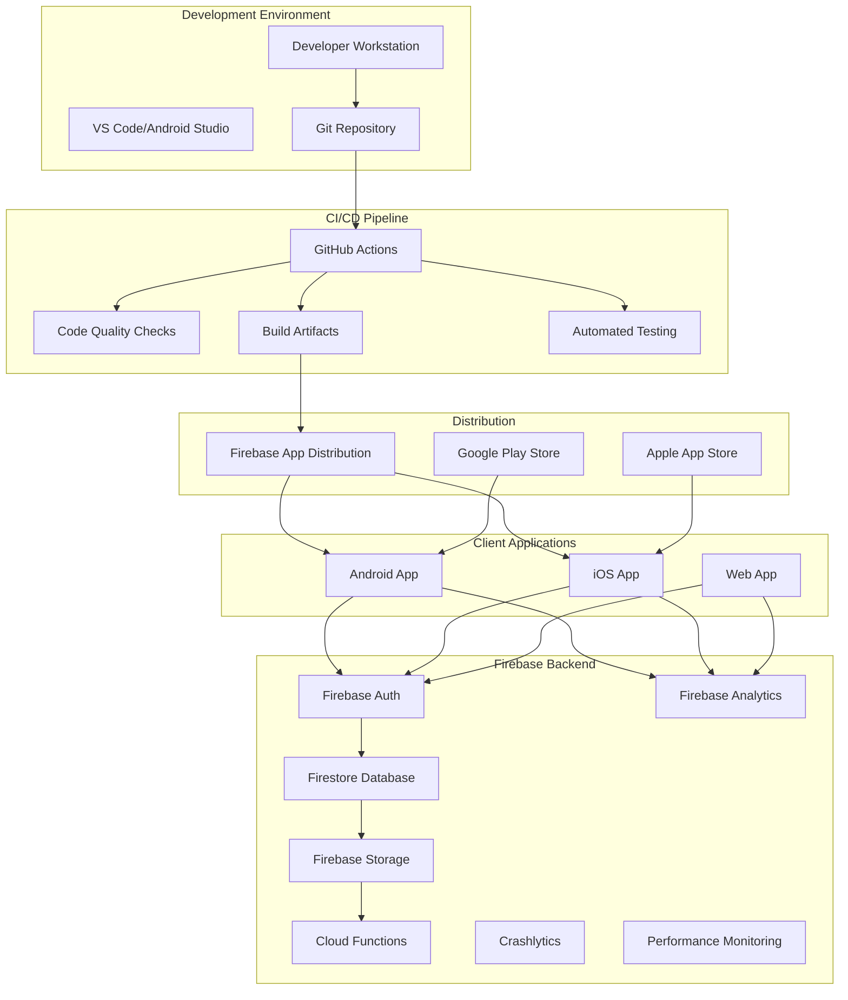
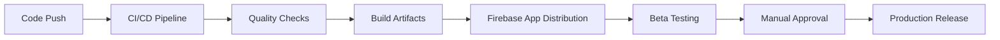

# Infrastructure Design Document

## Overview

This document outlines the comprehensive infrastructure design for the Cocktailian cocktail recipe app. The infrastructure encompasses Firebase backend services, CI/CD pipeline automation, development tooling, security measures, and production deployment capabilities. The design ensures scalable, maintainable, and secure infrastructure that supports the 24-week development timeline and future growth.

## Architecture

### High-Level Architecture



### Infrastructure Layers

1. **Development Layer**: Local development environment with Flutter SDK, IDE, and development tools
2. **Source Control Layer**: Git repository with branch protection and collaboration features
3. **CI/CD Layer**: Automated pipeline for code quality, testing, and build generation
4. **Backend Services Layer**: Firebase services for authentication, data storage, and monitoring
5. **Distribution Layer**: Automated deployment and app distribution systems
6. **Client Layer**: Multi-platform Flutter applications (Android, iOS, Web)

## Components and Interfaces

### Firebase Backend Services

#### Authentication Service
- **Purpose**: User authentication and authorization
- **Implementation**: Firebase Auth with multiple providers
- **Supported Methods**:
  - Email/Password authentication
  - Google Sign-In integration
  - Anonymous authentication for guest users
- **Security Features**:
  - JWT token-based authentication
  - Automatic token refresh
  - Session management
  - Multi-factor authentication support (future)

#### Database Service (Firestore)
- **Purpose**: NoSQL document database for app data
- **Collections Structure**:
  ```
  /users/{userId}
    - profile information
    - preferences
    - inventory
  
  /recipes/{recipeId}
    - recipe details
    - ingredients
    - instructions
    - ratings
  
  /ingredients/{ingredientId}
    - ingredient information
    - categories
    - substitutions
  
  /reviews/{reviewId}
    - user reviews
    - ratings
    - photos
  ```
- **Security**: Firestore security rules for data access control
- **Performance**: Indexed queries and compound indexes for filtering

#### Storage Service
- **Purpose**: File storage for recipe images and user content
- **Structure**:
  ```
  /recipes/{recipeId}/
    - main_image.jpg
    - step_images/
  
  /ingredients/{ingredientId}/
    - ingredient_image.jpg
  
  /users/{userId}/
    - profile_image.jpg
  ```
- **Security**: Storage security rules with user-based access control
- **Optimization**: Image compression and multiple resolution support

#### Cloud Functions (Future)
- **Purpose**: Server-side logic and data processing
- **Functions**:
  - Recipe moderation and approval
  - Image processing and optimization
  - Notification sending
  - Data aggregation and analytics

### CI/CD Pipeline Components

#### Code Quality Pipeline
- **Triggers**: Push to main branch, pull requests
- **Checks**:
  - Flutter analyze with zero tolerance
  - Dart format validation
  - Unit and widget test execution
  - Test coverage reporting
- **Tools**: GitHub Actions, Flutter SDK, lcov

#### Build Pipeline
- **Triggers**: Push to main branch
- **Artifacts**:
  - Debug APK for testing
  - Release AAB for production
  - Coverage reports
- **Distribution**: Firebase App Distribution for beta testing
- **Integration**: Automated versioning and release notes

#### Security Pipeline
- **Dependency Scanning**: Automated vulnerability checks
- **Secret Management**: GitHub Secrets for sensitive data
- **Code Scanning**: Static analysis for security issues
- **Compliance**: GDPR and privacy regulation compliance

### Development Environment

#### Flutter Project Structure
```
lib/
├── core/
│   ├── constants/        # App constants and configuration
│   ├── themes/          # Dark bar aesthetic themes
│   ├── utils/           # Utility functions
│   └── extensions/      # Dart extensions
├── data/
│   ├── models/          # Data models (Recipe, Ingredient, User)
│   ├── repositories/    # Data access layer
│   └── services/        # Firebase and external services
├── providers/           # Riverpod state management
├── widgets/
│   ├── common/          # Reusable Bar* widget library
│   ├── cards/           # Specialized card widgets
│   ├── forms/           # Form and input widgets
│   └── navigation/      # Navigation components
├── screens/
│   ├── discovery/       # Recipe discovery and search
│   ├── inventory/       # Ingredient management
│   ├── recipe/          # Recipe details and submission
│   └── profile/         # User profile and settings
└── main.dart
```

#### Development Tools
- **State Management**: Riverpod for reactive state management
- **Navigation**: GoRouter for declarative routing
- **Image Handling**: CachedNetworkImage for optimized image loading
- **Local Storage**: SharedPreferences for user preferences
- **Testing**: Flutter test framework with widget and integration tests

## Data Models

### Core Data Models

#### Recipe Model
```dart
class Recipe {
  final String id;
  final String name;
  final String description;
  final List<Ingredient> ingredients;
  final List<String> instructions;
  final String imageUrl;
  final double rating;
  final int reviewCount;
  final String authorId;
  final DateTime createdAt;
  final DateTime updatedAt;
  final List<String> tags;
  final RecipeCategory category;
  final DifficultyLevel difficulty;
}
```

#### Ingredient Model
```dart
class Ingredient {
  final String id;
  final String name;
  final IngredientCategory category;
  final String? amount;
  final String? unit;
  final bool isOptional;
  final List<String> substitutions;
  final String? imageUrl;
  final bool isAvailable; // User inventory status
}
```

#### User Model
```dart
class User {
  final String id;
  final String email;
  final String? displayName;
  final String? photoUrl;
  final List<String> inventory; // Ingredient IDs
  final UserPreferences preferences;
  final DateTime createdAt;
  final DateTime lastLoginAt;
}
```

### Database Schema Design

#### Firestore Collections
- **Optimized for Queries**: Denormalized data for efficient filtering
- **Scalable Structure**: Subcollections for related data
- **Index Strategy**: Composite indexes for complex queries
- **Data Consistency**: Transaction-based updates for critical operations

## Error Handling

### Client-Side Error Handling

#### Network Errors
- **Connection Issues**: Offline mode with cached data
- **Timeout Handling**: Retry mechanisms with exponential backoff
- **Rate Limiting**: Graceful degradation when limits exceeded
- **User Feedback**: Clear error messages with suggested actions

#### Authentication Errors
- **Token Expiration**: Automatic token refresh
- **Invalid Credentials**: Clear error messages and recovery options
- **Account Issues**: Account recovery and support contact information
- **Permission Errors**: Appropriate access denied messages

#### Data Validation Errors
- **Input Validation**: Client-side validation with server-side verification
- **Schema Validation**: Type checking and format validation
- **Business Logic Errors**: Clear feedback for constraint violations
- **Conflict Resolution**: Optimistic updates with conflict detection

### Server-Side Error Handling

#### Firebase Errors
- **Service Unavailability**: Fallback mechanisms and user notification
- **Quota Exceeded**: Usage monitoring and alerts
- **Security Rule Violations**: Proper error logging and user feedback
- **Data Corruption**: Backup and recovery procedures

#### Monitoring and Alerting
- **Error Tracking**: Firebase Crashlytics for crash reporting
- **Performance Monitoring**: Firebase Performance for app metrics
- **Custom Metrics**: Business-specific monitoring and alerts
- **Log Aggregation**: Centralized logging for debugging

## Testing Strategy

### Testing Pyramid

#### Unit Tests
- **Coverage Target**: 80% minimum code coverage
- **Focus Areas**:
  - Business logic and algorithms
  - Data models and validation
  - Utility functions and extensions
  - Provider state management logic
- **Tools**: Flutter test framework, Mockito for mocking

#### Widget Tests
- **Coverage**: All custom widgets and screens
- **Test Scenarios**:
  - Widget rendering and layout
  - User interaction handling
  - State changes and updates
  - Theme and responsive behavior
- **Tools**: Flutter widget testing, golden tests for UI consistency

#### Integration Tests
- **End-to-End Flows**:
  - User authentication flow
  - Recipe discovery and filtering
  - Ingredient inventory management
  - Recipe submission and review
- **Backend Integration**: Firebase services testing
- **Performance Testing**: Load testing and stress testing

### Automated Testing Pipeline

#### Continuous Testing
- **Trigger**: Every code push and pull request
- **Execution**: Parallel test execution for faster feedback
- **Reporting**: Test results and coverage reports
- **Quality Gates**: Tests must pass before merge

#### Device Testing
- **Physical Devices**: Testing on real Android and iOS devices
- **Emulator Testing**: Automated testing on various screen sizes
- **Cross-Platform**: Consistent behavior across platforms
- **Performance Profiling**: Memory and CPU usage analysis

## Security Architecture

### Authentication Security

#### Multi-Factor Authentication
- **Implementation**: Firebase Auth MFA support
- **Methods**: SMS, email, authenticator apps
- **Enforcement**: Required for sensitive operations
- **Recovery**: Secure account recovery mechanisms

#### Session Management
- **Token Security**: JWT tokens with appropriate expiration
- **Refresh Strategy**: Automatic token refresh
- **Logout Handling**: Secure session termination
- **Device Management**: Multiple device support with security

### Data Security

#### Firestore Security Rules
```javascript
rules_version = '2';
service cloud.firestore {
  match /databases/{database}/documents {
    // Users can only access their own data
    match /users/{userId} {
      allow read, write: if request.auth != null && request.auth.uid == userId;
    }
    
    // Recipes are publicly readable, but only owners can modify
    match /recipes/{recipeId} {
      allow read: if true;
      allow write: if request.auth != null && 
        (request.auth.uid == resource.data.authorId || 
         request.auth.uid in get(/databases/$(database)/documents/admins/list).data.users);
    }
    
    // Reviews can be created by authenticated users, modified by owners
    match /reviews/{reviewId} {
      allow read: if true;
      allow create: if request.auth != null;
      allow update, delete: if request.auth != null && request.auth.uid == resource.data.authorId;
    }
  }
}
```

#### Storage Security Rules
```javascript
rules_version = '2';
service firebase.storage {
  match /b/{bucket}/o {
    // Recipe images are publicly readable
    match /recipes/{recipeId}/{allPaths=**} {
      allow read: if true;
      allow write: if request.auth != null;
    }
    
    // User profile images are private
    match /users/{userId}/{allPaths=**} {
      allow read, write: if request.auth != null && request.auth.uid == userId;
    }
  }
}
```

### Infrastructure Security

#### API Security
- **Rate Limiting**: Prevent abuse and DoS attacks
- **Input Validation**: Sanitize all user inputs
- **CORS Configuration**: Proper cross-origin resource sharing
- **HTTPS Enforcement**: All communications encrypted

#### Secret Management
- **Environment Variables**: Secure configuration management
- **GitHub Secrets**: CI/CD pipeline secret storage
- **Key Rotation**: Regular API key and certificate rotation
- **Access Control**: Principle of least privilege

## Deployment Strategy

### Environment Management

#### Development Environment
- **Firebase Project**: `cocktailian-dev-2025`
- **Purpose**: Development and testing
- **Data**: Test data and development content
- **Access**: Development team only

#### Production Environment
- **Firebase Project**: `cocktailian-app-2025`
- **Purpose**: Live application
- **Data**: Real user data and content
- **Access**: Restricted production access

### Deployment Pipeline

#### Automated Deployment


#### Release Management
- **Versioning**: Semantic versioning (MAJOR.MINOR.PATCH)
- **Release Notes**: Automated generation from commit messages
- **Rollback Strategy**: Quick rollback capabilities
- **Feature Flags**: Gradual feature rollout

### Monitoring and Maintenance

#### Performance Monitoring
- **Firebase Performance**: App startup and screen rendering metrics
- **Custom Metrics**: Business-specific performance indicators
- **Real User Monitoring**: Actual user experience tracking
- **Alerting**: Automated alerts for performance degradation

#### Health Monitoring
- **Service Health**: Firebase service availability monitoring
- **Error Rates**: Crash and error rate tracking
- **User Metrics**: Active users and engagement metrics
- **Resource Usage**: Database and storage usage monitoring

## Backup and Recovery

### Data Backup Strategy

#### Firestore Backup
- **Automated Backups**: Daily automated Firestore exports
- **Retention Policy**: 30-day backup retention
- **Geographic Distribution**: Multi-region backup storage
- **Point-in-Time Recovery**: Ability to restore to specific timestamps

#### Storage Backup
- **Image Backup**: Automated Firebase Storage backup
- **Redundancy**: Multi-region storage redundancy
- **Version Control**: File version history and recovery
- **Disaster Recovery**: Cross-region disaster recovery plan

### Recovery Procedures

#### Data Recovery
- **Recovery Time Objective (RTO)**: 4 hours maximum downtime
- **Recovery Point Objective (RPO)**: 1 hour maximum data loss
- **Automated Recovery**: Scripted recovery procedures
- **Manual Procedures**: Step-by-step manual recovery guides

#### Business Continuity
- **Service Degradation**: Graceful degradation strategies
- **Communication Plan**: User communication during outages
- **Status Page**: Real-time service status updates
- **Post-Incident Review**: Learning and improvement process

## Scalability Considerations

### Database Scaling
- **Query Optimization**: Efficient query patterns and indexing
- **Data Partitioning**: Horizontal scaling strategies
- **Caching Strategy**: Client-side and server-side caching
- **Connection Pooling**: Efficient database connection management

### Infrastructure Scaling
- **Auto-scaling**: Automatic resource scaling based on demand
- **Load Balancing**: Traffic distribution across resources
- **CDN Integration**: Content delivery network for global performance
- **Microservices**: Future migration to microservices architecture

### Cost Optimization
- **Usage Monitoring**: Real-time cost and usage tracking
- **Resource Optimization**: Efficient resource utilization
- **Pricing Tiers**: Appropriate Firebase pricing plan selection
- **Budget Alerts**: Automated cost monitoring and alerts