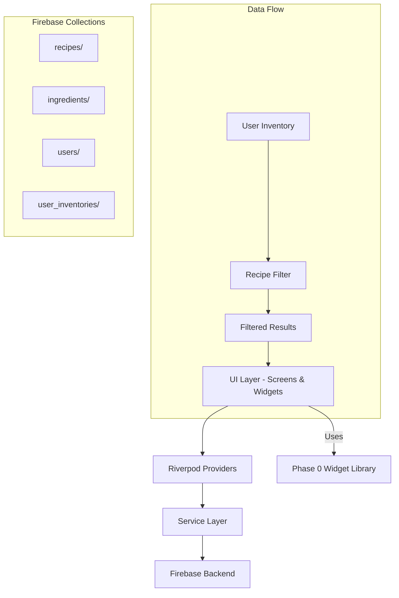

# Design Document - Phase 1: Core Discovery Engine

## Overview

The Core Discovery Engine implements ingredient-based cocktail discovery through a sophisticated filtering system, real-time inventory management, and optimized recipe display. The design leverages Firebase as the backend, Riverpod for state management, and the existing Phase 0 widget library for consistent UI.

## Architecture

### High-Level Architecture



### Data Architecture

#### Firebase Collections Structure
```
cocktailian-app-2025/
├── recipes/{recipeId}
│   ├── name: string
│   ├── ingredients: array<RecipeIngredient>
│   ├── instructions: array<string>
│   ├── imageUrl: string
│   ├── difficulty: number (1-5)
│   ├── prepTimeMinutes: number
│   ├── averageRating: number
│   ├── ratingCount: number
│   ├── tags: array<string>
│   └── metadata: object
├── ingredients/{ingredientId}
│   ├── name: string
│   ├── category: IngredientCategory
│   ├── aliases: array<string>
│   ├── substitutes: array<string>
│   ├── isAlcoholic: boolean
│   └── description: string?
└── user_inventories/{userId}
    ├── ingredientIds: array<string>
    └── lastUpdated: timestamp
```

## Components and Interfaces

### Core Data Models

#### Ingredient Model
```dart
class Ingredient {
  final String id;
  final String name;
  final IngredientCategory category;
  final List<String> aliases;
  final List<String> substitutes;
  final bool isAlcoholic;
  final String? description;
  
  // JSON serialization methods
  factory Ingredient.fromJson(Map<String, dynamic> json);
  Map<String, dynamic> toJson();
}

enum IngredientCategory {
  spirits,    // whiskey, vodka, gin, rum
  liqueurs,   // triple sec, amaretto
  mixers,     // club soda, tonic, juices
  bitters,    // angostura, orange
  garnishes,  // lemon, lime, olives
  syrups,     // simple syrup, grenadine
  other
}
```

#### Recipe Model
```dart
class Recipe {
  final String id;
  final String name;
  final List<RecipeIngredient> ingredients;
  final List<String> instructions;
  final String imageUrl;
  final int difficulty;
  final int prepTimeMinutes;
  final double averageRating;
  final int ratingCount;
  final List<String> tags;
  
  factory Recipe.fromJson(Map<String, dynamic> json);
  Map<String, dynamic> toJson();
}

class RecipeIngredient {
  final String ingredientId;
  final String amount;
  final String unit;
  final bool isOptional;
}
```

#### User Inventory Model
```dart
class UserInventory {
  final String userId;
  final Set<String> ingredientIds;
  final DateTime lastUpdated;
  
  factory UserInventory.fromJson(Map<String, dynamic> json);
  Map<String, dynamic> toJson();
}
```

### Service Layer

#### Firebase Service
```dart
class FirebaseService {
  // Existing implementation from Issue #3
  FirebaseFirestore get firestore;
  FirebaseAuth get auth;
  FirebaseStorage get storage;
  
  CollectionReference collection(String path);
  DocumentReference document(String path);
  Reference storageRef([String? path]);
}
```

#### Ingredient Service
```dart
class IngredientService {
  final FirebaseService _firebase;
  
  // Core operations
  Future<List<Ingredient>> getAllIngredients();
  Future<List<Ingredient>> searchIngredients(String query);
  Future<List<Ingredient>> getIngredientsByCategory(IngredientCategory category);
  Future<Ingredient?> getIngredientById(String id);
  
  // Caching and optimization
  Stream<List<Ingredient>> watchIngredients();
  Future<void> cacheIngredientsLocally();
}
```

#### Recipe Service
```dart
class RecipeService {
  final FirebaseService _firebase;
  
  // Recipe operations
  Future<List<Recipe>> getAllRecipes();
  Future<Recipe?> getRecipeById(String id);
  Future<List<RecipeMatch>> getFilteredRecipes(UserInventory inventory);
  
  // Search and filtering
  Future<List<Recipe>> searchRecipes(String query);
  Future<List<Recipe>> getRecipesByDifficulty(int maxDifficulty);
  Future<List<Recipe>> getRecipesByTags(List<String> tags);
}
```

#### Inventory Service
```dart
class InventoryService {
  final FirebaseService _firebase;
  
  // Inventory management
  Future<UserInventory> getUserInventory(String userId);
  Future<void> addIngredient(String userId, String ingredientId);
  Future<void> removeIngredient(String userId, String ingredientId);
  Future<void> updateInventory(UserInventory inventory);
  
  // Bulk operations
  Future<void> addMultipleIngredients(String userId, List<String> ingredientIds);
  Future<void> importBarSetup(String userId, BarSetupType type);
}
```

### State Management (Riverpod Providers)

#### Core Providers
```dart
// Firebase service provider
final firebaseServiceProvider = Provider<FirebaseService>((ref) {
  return FirebaseService();
});

// Service providers
final ingredientServiceProvider = Provider<IngredientService>((ref) {
  return IngredientService(ref.read(firebaseServiceProvider));
});

final recipeServiceProvider = Provider<RecipeService>((ref) {
  return RecipeService(ref.read(firebaseServiceProvider));
});

final inventoryServiceProvider = Provider<InventoryService>((ref) {
  return InventoryService(ref.read(firebaseServiceProvider));
});
```

#### Data Providers
```dart
// Ingredient providers
final allIngredientsProvider = FutureProvider<List<Ingredient>>((ref) {
  return ref.read(ingredientServiceProvider).getAllIngredients();
});

final ingredientSearchProvider = FutureProvider.family<List<Ingredient>, String>((ref, query) {
  return ref.read(ingredientServiceProvider).searchIngredients(query);
});

// User inventory provider
final userInventoryProvider = StateNotifierProvider<UserInventoryNotifier, UserInventory>((ref) {
  return UserInventoryNotifier(ref.read(inventoryServiceProvider));
});

// Recipe filtering provider
final filteredRecipesProvider = FutureProvider.family<List<RecipeMatch>, UserInventory>((ref, inventory) {
  return ref.read(recipeServiceProvider).getFilteredRecipes(inventory);
});
```

### Recipe Filtering Algorithm

#### Match Types
```dart
enum MatchType {
  exactMatch,           // Can make with current inventory
  oneIngredientMissing, // Missing 1 ingredient
  twoIngredientsMissing, // Missing 2 ingredients
  substitutionPossible, // Can substitute ingredients
  notPossible          // Cannot make
}

class RecipeMatch {
  final Recipe recipe;
  final MatchType matchType;
  final List<String> missingIngredientIds;
  final List<IngredientSubstitution> possibleSubstitutions;
  final double matchScore; // 0.0 to 1.0
}
```

#### Filtering Logic
```dart
class RecipeFilterService {
  List<RecipeMatch> filterRecipes(List<Recipe> recipes, UserInventory inventory) {
    return recipes
        .map((recipe) => _calculateMatch(recipe, inventory))
        .where((match) => match.matchType != MatchType.notPossible)
        .toList()
      ..sort((a, b) => b.matchScore.compareTo(a.matchScore));
  }
  
  RecipeMatch _calculateMatch(Recipe recipe, UserInventory inventory) {
    // Implementation details for matching algorithm
    // Priority: exact matches > 1 missing > 2 missing > substitutions
  }
}
```

## User Interface Design

### Screen Architecture

#### Discovery Screen (Home)
```dart
class DiscoveryScreen extends ConsumerWidget {
  @override
  Widget build(BuildContext context, WidgetRef ref) {
    final inventory = ref.watch(userInventoryProvider);
    final filteredRecipes = ref.watch(filteredRecipesProvider(inventory));
    
    return Scaffold(
      appBar: BarAppBar(title: 'Discover Cocktails'),
      body: Column(
        children: [
          _buildQuickInventorySection(),
          _buildRecipeSections(filteredRecipes),
        ],
      ),
    );
  }
}
```

#### Inventory Management Screen
```dart
class InventoryScreen extends ConsumerWidget {
  @override
  Widget build(BuildContext context, WidgetRef ref) {
    return Scaffold(
      appBar: BarAppBar(
        title: 'My Bar Inventory',
        actions: [_buildBulkAddButton()],
      ),
      body: Column(
        children: [
          BarSearchField(
            hintText: 'Search ingredients...',
            onChanged: _handleSearch,
          ),
          _buildCategoryTabs(),
          _buildIngredientList(),
        ],
      ),
    );
  }
}
```

#### Recipe Details Screen
```dart
class RecipeDetailsScreen extends ConsumerWidget {
  final String recipeId;
  
  @override
  Widget build(BuildContext context, WidgetRef ref) {
    final recipe = ref.watch(recipeProvider(recipeId));
    final inventory = ref.watch(userInventoryProvider);
    
    return Scaffold(
      body: CustomScrollView(
        slivers: [
          _buildImageHeader(recipe),
          _buildRecipeInfo(recipe),
          _buildIngredientsList(recipe, inventory),
          _buildInstructions(recipe),
        ],
      ),
    );
  }
}
```

### Widget Integration (Phase 0)

#### Recipe Cards
```dart
// Using existing BarCard from Phase 0
BarCard(
  title: recipe.name,
  subtitle: '${recipe.prepTimeMinutes} min • ${recipe.difficulty}/5 difficulty',
  imageUrl: recipe.imageUrl,
  rating: recipe.averageRating,
  tags: recipe.tags,
  missingIngredients: match.missingIngredientIds.length,
  onTap: () => _navigateToRecipe(recipe.id),
)
```

#### Ingredient Chips
```dart
// Using existing BarChip from Phase 0
BarChip.ingredient(
  label: ingredient.name,
  isSelected: inventory.ingredientIds.contains(ingredient.id),
  isAvailable: true,
  onTap: () => _toggleIngredient(ingredient.id),
)
```

## Data Models

### Firestore Security Rules
```javascript
rules_version = '2';
service cloud.firestore {
  match /databases/{database}/documents {
    // Public read access to recipes and ingredients
    match /recipes/{recipeId} {
      allow read: if true;
      allow write: if false; // Admin only for Phase 1
    }
    
    match /ingredients/{ingredientId} {
      allow read: if true;
      allow write: if false; // Admin only for Phase 1
    }
    
    // User-specific inventory access
    match /user_inventories/{userId} {
      allow read, write: if request.auth != null && request.auth.uid == userId;
    }
  }
}
```

### Data Seeding Strategy

#### Initial Recipe Collection (50 recipes)
- **Classic Cocktails**: Old Fashioned, Martini, Manhattan, Negroni
- **Popular Modern**: Espresso Martini, Paper Plane, Penicillin
- **Easy Cocktails**: Gin & Tonic, Rum & Coke, Whiskey Sour
- **Variety by Spirit**: Equal distribution across whiskey, gin, vodka, rum, tequila

#### Ingredient Database (~200 ingredients)
- **Spirits**: 40 common spirits across categories
- **Liqueurs**: 30 popular liqueurs and cordials
- **Mixers**: 50 mixers, sodas, and juices
- **Garnishes**: 25 common garnishes and aromatics
- **Bitters & Syrups**: 20 bitters and syrups
- **Other**: 35 miscellaneous ingredients

## Error Handling

### Network Error Handling
```dart
class NetworkErrorHandler {
  static Future<T> handleNetworkCall<T>(Future<T> Function() call) async {
    try {
      return await call();
    } on FirebaseException catch (e) {
      throw _mapFirebaseError(e);
    } on SocketException {
      throw NetworkException('No internet connection');
    } catch (e) {
      throw UnknownException('An unexpected error occurred');
    }
  }
}
```

### User-Facing Error States
- **No Internet**: Show cached data with offline indicator
- **Empty Inventory**: Encourage adding ingredients with popular suggestions
- **No Recipe Matches**: Suggest popular ingredients to add
- **Recipe Load Failed**: Show retry button with error message

## Testing Strategy

### Unit Testing
```dart
// Model testing
group('Ingredient Model', () {
  test('should serialize to/from JSON correctly', () {
    // Test implementation
  });
});

// Service testing
group('Recipe Service', () {
  test('should filter recipes correctly', () {
    // Test filtering algorithm
  });
});
```

### Widget Testing
```dart
// Screen testing
group('Discovery Screen', () {
  testWidgets('should display recipe cards', (tester) async {
    // Test widget rendering
  });
});
```

### Integration Testing
```dart
// End-to-end testing
group('Recipe Discovery Flow', () {
  testWidgets('should update recipes when inventory changes', (tester) async {
    // Test complete user flow
  });
});
```

## Performance Considerations

### Caching Strategy
- **Local Storage**: Cache ingredients and popular recipes
- **Image Caching**: Use cached_network_image with custom cache policy
- **Query Optimization**: Implement Firestore compound indices
- **Debouncing**: 300ms debounce for inventory changes

### Memory Management
- **Lazy Loading**: Implement pagination for large recipe lists
- **Image Optimization**: Compress and resize images appropriately
- **Provider Disposal**: Proper cleanup of Riverpod providers

### Real-time Performance Targets
- **Ingredient Search**: < 200ms response time
- **Recipe Filtering**: < 100ms after inventory change
- **Screen Navigation**: < 300ms transition time
- **App Cold Start**: < 3 seconds on mid-range devices

This design provides a solid foundation for implementing the Phase 1 Core Discovery Engine while maintaining consistency with the established architecture and design patterns.