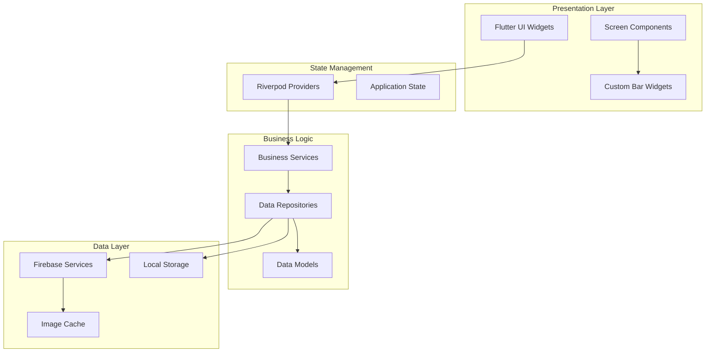

# Master Design Document - 24-Week Project Timeline

## Overview

This document provides the comprehensive design architecture for Cocktailian across all development phases. It serves as the master reference for the complete application design, covering all features planned for the 24-week development timeline.

**Purpose**: Master design reference for all phases and features
**Current Development**: See `../phase-1-core-discovery-engine/design.md` for active Phase 1 implementation details
**Foundation**: Built on Phase 0 widget library and Issue #3 infrastructure

Cocktailian is a sophisticated cocktail discovery application built with Flutter and Firebase, designed to help home bartenders discover recipes based on their available ingredients. The application follows a phased development approach over 24 weeks, with a focus on ingredient-based filtering, community features, and a premium dark bar aesthetic.

## Architecture

### High-Level Architecture



### Technology Stack

- **Frontend**: Flutter 3.8+ with Material Design 3
- **State Management**: Riverpod 2.4+
- **Backend**: Firebase (Firestore, Auth, Storage)
- **Navigation**: GoRouter 12.1+
- **Image Handling**: CachedNetworkImage 3.3+
- **Local Storage**: SharedPreferences 2.2+
- **Testing**: Flutter Test + Integration Test

### Design Principles

1. **Theme-First Design**: All UI components use the cocktail theme system with zero hardcoded colors
2. **Component-Based Architecture**: Reusable Bar* widgets for consistent UI
3. **Offline-First**: Core functionality works without internet connection
4. **Performance-Optimized**: Real-time filtering with <100ms response times
5. **Accessibility-Compliant**: WCAG 2.1 AA standards with proper contrast ratios

## Components and Interfaces

### Core Data Models

**Note**: Detailed data model implementations are defined in the active phase specifications. See `../phase-1-core-discovery-engine/design.md` for current data models.

#### High-Level Model Overview
- **Recipe Model**: Core recipe data with ingredients, instructions, ratings, and metadata
- **Ingredient Model**: Ingredient information with categories, substitutions, and availability
- **User Models**: User profiles, inventory management, and preferences
- **Community Models**: Reviews, ratings, collections, and social features (future phases)

### Service Layer Architecture

#### Firebase Service (Existing)
- Handles Firebase initialization and connection management
- Provides access to Firestore, Auth, and Storage instances
- Implements connection testing and error handling

#### Recipe Service
```dart
class RecipeService {
  Future<List<Recipe>> getRecipesByIngredients(List<String> ingredientIds);
  Future<List<Recipe>> searchRecipes(String query);
  Future<Recipe?> getRecipeById(String id);
  Future<List<Recipe>> getFeaturedRecipes();
  Future<void> rateRecipe(String recipeId, double rating);
  Future<void> submitRecipe(Recipe recipe);
}
```

#### Ingredient Service
```dart
class IngredientService {
  Future<List<Ingredient>> getAllIngredients();
  Future<List<Ingredient>> searchIngredients(String query);
  Future<List<Ingredient>> getIngredientsByCategory(IngredientCategory category);
  Future<List<String>> getIngredientSuggestions(String partial);
}
```

#### User Service
```dart
class UserService {
  Future<UserProfile?> getCurrentUser();
  Future<void> updateUserInventory(List<String> ingredientIds);
  Future<void> updateUserPreferences(UserPreferences preferences);
  Future<void> addFavoriteRecipe(String recipeId);
  Future<void> removeFavoriteRecipe(String recipeId);
}
```

### State Management with Riverpod

#### Core Providers
```dart
// Theme Provider (Existing)
final themeProvider = StateNotifierProvider<ThemeNotifier, CocktailThemeData>

// Authentication Provider
final authProvider = StreamProvider<User?>

// User Profile Provider
final userProfileProvider = FutureProvider<UserProfile?>

// User Inventory Provider
final userInventoryProvider = StateNotifierProvider<InventoryNotifier, UserInventory>

// Recipe Providers
final recipesProvider = FutureProvider<List<Recipe>>
final filteredRecipesProvider = Provider<List<Recipe>>
final recipeDetailProvider = FutureProvider.family<Recipe?, String>

// Ingredient Providers
final ingredientsProvider = FutureProvider<List<Ingredient>>
final ingredientSearchProvider = FutureProvider.family<List<Ingredient>, String>
```

#### Filtering Algorithm Provider
```dart
final recipeFilterProvider = Provider<RecipeFilter>((ref) {
  final inventory = ref.watch(userInventoryProvider);
  final preferences = ref.watch(userPreferencesProvider);
  
  return RecipeFilter(
    availableIngredients: inventory.ingredientIds,
    dietaryRestrictions: preferences.dietaryRestrictions,
    maxDifficulty: preferences.maxDifficulty,
  );
});
```

### UI Component Architecture

#### Screen Structure
```
lib/screens/
├── discovery/
│   ├── discovery_screen.dart          # Main recipe discovery
│   ├── recipe_detail_screen.dart      # Individual recipe view
│   └── search_screen.dart             # Recipe search
├── inventory/
│   ├── inventory_screen.dart          # Ingredient management
│   └── add_ingredient_screen.dart     # Add new ingredients
├── profile/
│   ├── profile_screen.dart            # User profile
│   ├── settings_screen.dart           # App settings
│   └── auth_screen.dart               # Login/register
└── recipe/
    ├── recipe_submission_screen.dart  # Submit new recipes
    └── menu_planning_screen.dart      # Event menu planning
```

#### Custom Widget Integration
The design leverages the existing Bar* widget library:

- **BarCard**: Recipe cards with ratings, availability indicators
- **BarChip**: Ingredient tags, filter chips, category chips
- **BarButton**: Primary actions, secondary actions, FAB
- **BarSearchField**: Recipe search, ingredient search with autocomplete
- **BarInput**: Form inputs for recipe submission, user profile
- **BarRating**: Recipe ratings, user reviews
- **BarLoading**: Loading states for data fetching
- **BarEmptyState**: Empty inventory, no search results
- **BarModal**: Confirmation dialogs, recipe sharing options

## Data Models

### Firestore Database Schema

#### Collections Structure
```
/recipes
  /{recipeId}
    - name: string
    - description: string
    - ingredients: array<RecipeIngredient>
    - instructions: array<string>
    - imageUrl: string
    - difficulty: string
    - prepTimeMinutes: number
    - averageRating: number
    - ratingCount: number
    - tags: array<string>
    - dietaryRestrictions: array<string>
    - createdAt: timestamp
    - authorId: string (optional)
    - isUserSubmitted: boolean

/ingredients
  /{ingredientId}
    - name: string
    - category: string
    - description: string
    - aliases: array<string>
    - substitutions: array<string>
    - isCommon: boolean
    - imageUrl: string (optional)

/users
  /{userId}
    - email: string
    - displayName: string (optional)
    - photoUrl: string (optional)
    - favoriteRecipeIds: array<string>
    - inventory: UserInventory
    - preferences: UserPreferences
    - createdAt: timestamp
    - lastActiveAt: timestamp

/ratings
  /{ratingId}
    - recipeId: string
    - userId: string
    - rating: number (1-5)
    - review: string (optional)
    - photos: array<string> (optional)
    - createdAt: timestamp
    - helpfulVotes: number

/menus
  /{menuId}
    - userId: string
    - name: string
    - description: string
    - recipeIds: array<string>
    - guestCount: number
    - eventType: string
    - createdAt: timestamp
```

#### Indexing Strategy
```javascript
// Firestore Indexes
recipes:
  - ingredients.ingredientId (array-contains)
  - averageRating (descending)
  - difficulty + averageRating
  - tags (array-contains) + averageRating
  - createdAt (descending)

ingredients:
  - category + name
  - isCommon + category

ratings:
  - recipeId + createdAt (descending)
  - userId + createdAt (descending)
```

### Recipe Filtering Algorithm

#### Priority-Based Sorting
1. **Exact Matches**: Recipes where user has all required ingredients
2. **Substitution Matches**: Recipes where user has acceptable substitutions
3. **Almost Possible**: Recipes missing 1-2 ingredients, sorted by fewest missing
4. **Aspirational**: Recipes missing 3+ ingredients, sorted by rating

#### Real-Time Filtering Implementation
```dart
class RecipeFilterService {
  List<RecipeMatch> filterRecipes(
    List<Recipe> recipes,
    List<String> availableIngredients,
    UserPreferences preferences,
  ) {
    return recipes
        .map((recipe) => _calculateMatch(recipe, availableIngredients))
        .where((match) => _meetsPreferences(match.recipe, preferences))
        .toList()
        ..sort((a, b) => _compareMatches(a, b));
  }
  
  RecipeMatch _calculateMatch(Recipe recipe, List<String> available) {
    final required = recipe.ingredients.where((i) => !i.isOptional);
    final missing = <RecipeIngredient>[];
    final substitutions = <RecipeIngredient>[];
    
    for (final ingredient in required) {
      if (available.contains(ingredient.ingredientId)) {
        continue; // Have exact ingredient
      }
      
      final hasSubstitution = ingredient.substitutions
          .any((sub) => available.contains(sub));
      
      if (hasSubstitution) {
        substitutions.add(ingredient);
      } else {
        missing.add(ingredient);
      }
    }
    
    return RecipeMatch(
      recipe: recipe,
      matchType: _determineMatchType(missing.length, substitutions.length),
      missingIngredients: missing,
      substitutionIngredients: substitutions,
    );
  }
}
```

## Error Handling

### Error Categories and Strategies

#### Network Errors
- **Offline Mode**: Cache essential data locally using SharedPreferences
- **Timeout Handling**: Implement retry logic with exponential backoff
- **Connection Recovery**: Automatic sync when connection restored

#### Authentication Errors
- **Session Expiry**: Automatic token refresh with Firebase Auth
- **Permission Errors**: Clear error messages with suggested actions
- **Account Issues**: Guided recovery flows

#### Data Validation Errors
- **Recipe Submission**: Client-side validation with server-side verification
- **Ingredient Search**: Fuzzy matching with suggestion fallbacks
- **User Input**: Real-time validation with helpful error messages

#### Firebase Errors
```dart
class FirebaseErrorHandler {
  static String getErrorMessage(FirebaseException error) {
    switch (error.code) {
      case 'permission-denied':
        return 'You don\'t have permission to access this content.';
      case 'unavailable':
        return 'Service temporarily unavailable. Please try again.';
      case 'deadline-exceeded':
        return 'Request timed out. Please check your connection.';
      default:
        return 'Something went wrong. Please try again later.';
    }
  }
}
```

### User Experience Error Handling
- **Graceful Degradation**: Show cached content when possible
- **Loading States**: Use BarLoading widgets for all async operations
- **Empty States**: Use BarEmptyState with actionable suggestions
- **Error Recovery**: Clear retry buttons and alternative actions

## Testing Strategy

### Unit Testing
- **Data Models**: Serialization, validation, business logic
- **Services**: API calls, data transformation, error handling
- **Providers**: State management, filtering algorithms
- **Utilities**: Helper functions, extensions, constants

### Widget Testing
- **Custom Widgets**: All Bar* widgets with theme variations
- **Screens**: User interactions, navigation, state changes
- **Forms**: Input validation, submission flows
- **Error States**: Error displays, retry mechanisms

### Integration Testing
- **User Flows**: Complete recipe discovery workflow
- **Authentication**: Login, registration, profile management
- **Data Sync**: Offline/online synchronization
- **Performance**: Recipe filtering response times

### Testing Infrastructure
```dart
// Test Utilities
class TestHelpers {
  static Widget wrapWithProviders(Widget child) {
    return ProviderScope(
      overrides: [
        // Mock providers for testing
      ],
      child: MaterialApp(
        theme: CocktailThemes.midnightMartini,
        home: child,
      ),
    );
  }
  
  static List<Recipe> generateMockRecipes(int count) {
    // Generate test data
  }
}

// Mock Services
class MockRecipeService implements RecipeService {
  @override
  Future<List<Recipe>> getRecipesByIngredients(List<String> ingredientIds) {
    // Return mock data based on test scenarios
  }
}
```

### Performance Testing
- **Recipe Filtering**: <100ms response time for inventory changes
- **Image Loading**: Progressive loading with placeholder states
- **Database Queries**: Optimized indexes for common query patterns
- **Memory Usage**: Efficient image caching and disposal

## Security Considerations

### Firebase Security Rules
```javascript
// Firestore Security Rules
rules_version = '2';
service cloud.firestore {
  match /databases/{database}/documents {
    // Users can only access their own data
    match /users/{userId} {
      allow read, write: if request.auth != null && request.auth.uid == userId;
    }
    
    // Recipes are publicly readable, user-submitted ones require auth
    match /recipes/{recipeId} {
      allow read: if true;
      allow create: if request.auth != null && validateRecipe();
      allow update: if request.auth != null && 
        (resource.data.authorId == request.auth.uid || isAdmin());
    }
    
    // Ratings require authentication
    match /ratings/{ratingId} {
      allow read: if true;
      allow create, update: if request.auth != null && 
        request.auth.uid == resource.data.userId;
    }
  }
}
```

### Data Privacy
- **User Data**: Minimal collection, explicit consent
- **Recipe Submissions**: Content moderation before publication
- **Analytics**: Anonymous usage data only
- **GDPR Compliance**: Data export and deletion capabilities

### Input Validation
- **Recipe Submission**: Sanitize all user inputs
- **Search Queries**: Prevent injection attacks
- **Image Uploads**: Validate file types and sizes
- **Rate Limiting**: Prevent abuse of submission endpoints

## Performance Optimization

### Image Optimization
- **Caching Strategy**: CachedNetworkImage with custom cache manager
- **Progressive Loading**: Placeholder → Low-res → High-res
- **Compression**: Automatic image optimization in Firebase Storage
- **Lazy Loading**: Load images only when visible

### Database Optimization
- **Query Optimization**: Composite indexes for complex filters
- **Pagination**: Limit recipe results with cursor-based pagination
- **Caching**: Local caching of frequently accessed data
- **Batch Operations**: Efficient bulk updates for inventory changes

### State Management Optimization
- **Provider Scoping**: Minimize unnecessary rebuilds
- **Computed Values**: Cache expensive calculations
- **Selective Listening**: Watch only necessary state changes
- **Memory Management**: Proper disposal of providers and streams

## Accessibility Implementation

### Screen Reader Support
- **Semantic Labels**: Meaningful descriptions for all interactive elements
- **Navigation Order**: Logical focus traversal
- **Content Description**: Alternative text for images and icons
- **State Announcements**: Notify users of state changes

### Visual Accessibility
- **Color Contrast**: All themes meet WCAG 2.1 AA standards (4.5:1 minimum)
- **Text Scaling**: Support up to 200% text scaling
- **Focus Indicators**: Clear visual focus indicators
- **Color Independence**: Information not conveyed by color alone

### Motor Accessibility
- **Touch Targets**: Minimum 44px × 44px for all interactive elements
- **Gesture Alternatives**: Alternative input methods for complex gestures
- **Timing**: No time-based interactions without user control
- **Error Prevention**: Clear validation and confirmation dialogs

This design document provides a comprehensive foundation for implementing the Cocktailian application according to the specified requirements, leveraging the existing widget library and Firebase infrastructure while ensuring scalability, performance, and user experience excellence.